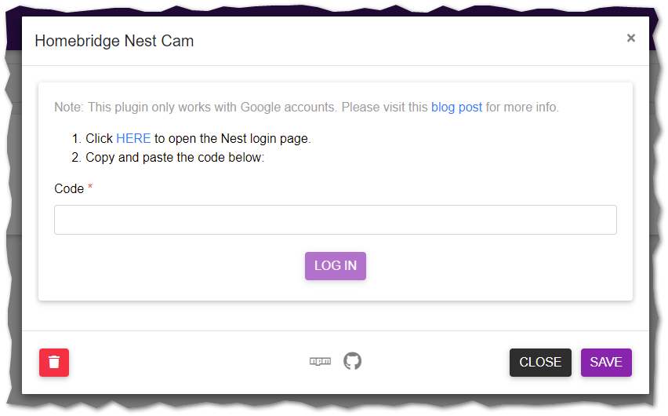

# Nest Authentication for homebridge-nest-cam

## Deprecation Warning

Google has been making moves toward deprecating Nest accounts (and the Nest-based APIs), as announced here:
* [https://nest.com/whats-happening](https://nest.com/whats-happening/)

However, as of Q4 2021, the old Nest Token-based authentication **still functions** for those who have not migrated to Google accounts yet.

There is no guarantee how long these method will remain.

## Installation Instructions

#### Option 1: Install via Homebridge Config UI X

Search for "nest-cam" in [homebridge-config-ui-x](https://github.com/oznu/homebridge-config-ui-x) and install `homebridge-nest-cam`.

#### Option 2: Manually Install

```sh
sudo npm install -g --unsafe-perm homebridge-nest-cam
```

## Configuration

***Note***: *all configuration must be done manually in your `config.json` - plugin-based config is not yet supported*

1. Cancel out of the initial authentication screen:<br>
   
1. Manually copy and paste this object template into your `config.json`, inside the `platforms` array:
    ```json
    {
        "nest_token": "TOKEN_GOES_HERE",
        "options": {
            "ffmpegCodec": "libx264",
            "streamQuality": 3,
            "alertCheckRate": 10,
            "alertCooldownRate": 180,
            "alertTypes": [],
            "importantOnly": true,
            "motionDetection": true,
            "streamingSwitch": true,
            "chimeSwitch": true,
            "announcementsSwitch": true,
            "doorbellAlerts": true,
            "doorbellSwitch": true,
            "audioSwitch": true
        },
        "platform": "Nest-cam",
        "name": "Nest Cameras"
    }
    ```
1. Log into <a href="https://home.nest.com" target="_blank">https://home.nest.com</a> and get to the main home screen
1. Once authenticated, change the URL and navigate to <a href="https://home.nest.com/session" target="_blank">https://home.nest.com/session</a>
1. Grab the value associated with the `access_token` key:<br>
   
   * *Note: this is the same access_token that [homebridge-nest](https://github.com/chrisjshull/homebridge-nest) uses if you want to grab from existing config*
1. Update your `config.json` and the `nest_token` key with the access token you copied, replacing `TOKEN_GOES_HERE`
1. Make any additional modifications to the configuration based on the [available options](../README.md#options)
1. Save your configuration and restart the [child] bridge as necessary